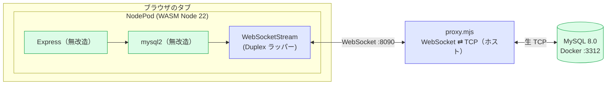

# nodepod-express-mysql-websocket-demo


-339933?logo=node.js&logoColor=white)


**ブラウザのタブの中だけで動く Express + mysql2 が、WebSocket トンネル経由で Docker の MySQL に接続する**検証デモ。

[NodePod](https://github.com/ScelarOrg/Nodepod)（WASM な Node.js をブラウザ内で動かすランタイム）の上で、**無改造の mysql2** を動かし、その `stream` オプションに「ブラウザの WebSocket を Duplex に見せかけたもの」を渡して、本物の MySQL とプロトコルを喋らせる。

> 検証したいこと：「ブラウザ内 NodePod の mysql2 は、WebSocket 越しに本物の MySQL へ繋がるのか？」 → **繋がる。トランザクション・JSON 型・prepared statement まで動く。**

ベースは [nodepod-express-demo](https://github.com/NOGUD626/nodepod-express-demo)。そこに mysql2 + WebSocket トランスポート + Docker MySQL を足したもの。

## 何ができたか

すべて **ブラウザ内の mysql2 が WebSocket 越しに実行**した結果（[scripts/verify.mjs](scripts/verify.mjs) で自動検証可能）。

| 機能 | 結果 |
|------|------|
| 接続・SELECT・日本語データ | ✅ |
| INSERT | ✅ |
| トランザクション（commit / rollback） | ✅ |
| JSON 型カラム + `JSON_EXTRACT` | ✅ |
| prepared statement（execute / 文字列・**数値**パラメータ） | ✅ |

## アーキテクチャ

```
ブラウザのタブ
┌─────────────────────────────────────────────┐
│ NodePod（WASM Node 22）                       │
│   Express（無改造）                            │
│     └ mysql2（無改造）                         │
│         └ stream: WebSocketStream（Duplex）   │
│              │ ブラウザの WebSocket            │
└──────────────┼──────────────────────────────┘
               │ ws://localhost:8090
        ┌──────▼──────┐
        │ proxy.mjs   │  WebSocket ⇄ TCP の土管（ホストの Node）
        └──────┬──────┘
               │ 生 TCP :3312
        ┌──────▼──────┐
        │ MySQL 8.0   │  Docker
        └─────────────┘
```



- ブラウザには生 TCP が無いので、mysql2 の `stream` に **ブラウザの WebSocket を Duplex 化したもの**を渡す（[src/vm-project.ts](src/vm-project.ts) の `ws-stream.js`）。
- NodePod は `localhost` 宛ての WebSocket を Service Worker 経由でホストへブリッジしてくれる。だから `ws://localhost:8090` がホストの proxy に届く。
- proxy は MySQL プロトコルを理解しない**ただのバイト素通し**（[proxy/proxy.mjs](proxy/proxy.mjs)）。

## NodePod 上で mysql2 を動かすために越えた壁

NodePod の WASM Node 環境は標準ライブラリの一部が未実装/バグがある。mysql2 を動かすには、`server.js` の冒頭で以下を**モンキーパッチ**する必要があった（[src/vm-project.ts](src/vm-project.ts) 参照）。

| # | 症状 | 原因 | 対処 |
|---|------|------|------|
| 1 | `Class constructor _BufferPolyfill cannot be invoked without 'new'` | `Buffer` が ES class でレガシーな `Buffer()` 関数呼びを許さない | `buffer` モジュールの `Buffer` を **Proxy** でラップし、`apply`（new 無し呼び）を `alloc`/`from` へ転送 |
| 2 | `offset is out of bounds`（認証パケット組立） | `Buffer.prototype.copy` の境界計算バグ | 自前のバイト単位 `copy` に差し替え |
| 3 | **`Access denied`**（認証失敗） | `crypto.createHash` が**ダミー値**を返す（SHA1 が壊れている） | **純 JS の SHA1 実装**で `createHash('sha1')` を差し替え |
| 4 | 列名が生のプロトコルバイト列になる | `Buffer.prototype.toString(enc, start, end)` が範囲引数を無視 | 範囲を尊重する実装に差し替え |
| 5 | `Start offset N is outside the bounds`（prepared 結果 parse） | `subarray`/`slice` が範囲外で throw（Node 標準は clamp） | clamp する薄いラッパーに差し替え |
| 6 | `Start offset N is outside the bounds`（数値 param） | `writeDoubleLE`/`readDoubleLE` の `DataView` 生成が byteOffset 非互換 | 独立 ArrayBuffer 上の DataView を介すバイト読み書きに差し替え |

> 一番の山は **#3（crypto の SHA1 が壊れている）**。mysql_native_password の認証スクランブルは SHA1 ベースなので、これを直すまで何をやっても `Access denied` だった。

## 動かし方

```bash
npm install
npm run db:up        # MySQL を Docker 起動（ホスト 3312 → コンテナ 3306）
npm run proxy        # 別ターミナル：WebSocket⇄TCP プロキシ（ws://localhost:8090）
npm run dev          # 別ターミナル：Vite（http://localhost:5173）
```

ブラウザで http://localhost:5173 を開き、「▶ NodePod を起動」→ 各 API ボタン。
ヘッドレスで一括検証する場合：

```bash
node scripts/verify.mjs   # Playwright で boot → 各 API を叩いて結果を表示
```

## 主な API（ブラウザ内 Express が配信）

| パス | 内容 |
|------|------|
| `/api/hello` | 生存確認（Node バージョン等） |
| `/api/db` | `NOW()/VERSION()` と `todos` を取得 |
| `/api/db-insert` | INSERT |
| `/api/db-advanced` | トランザクション / JSON 型 / prepared statement |
| `/api/ws-probe` `/api/buf-check` `/api/crypto-check` | NodePod 互換性の診断用 |

## ディレクトリ構成

```
nodepod-express-mysql-websocket-demo/
├─ docker/
│  ├─ docker-compose.yml   # MySQL 8.0（ホスト 3312）
│  └─ init.sql             # todos サンプルデータ（SET NAMES utf8mb4）
├─ proxy/
│  ├─ proxy.mjs            # WebSocket ⇄ TCP プロキシ（ホストの Node, ws のみ）
│  └─ package.json
├─ src/
│  ├─ main.ts              # NodePod boot → npm install express mysql2 → node server.js
│  └─ vm-project.ts        # 仮想 FS に展開する server.js / ws-stream.js / index.html（＝肝）
├─ scripts/
│  ├─ verify.mjs           # Playwright で全 API を自動検証
│  └─ screenshot.mjs       # スクリーンショット取得
├─ index.html              # ホスト側 UI（起動・ログ・iframe プレビュー）
└─ vite.config.ts          # nodepod() プラグイン
```

## できないこと / 注意

- **本番用途ではない**。proxy は MySQL を宛先固定の素通しトンネルで、認証も検証用ダミー（demo/demopass）。
- NodePod の標準ライブラリ非互換を上記モンキーパッチで埋めている。NodePod 側の更新で不要になる/壊れる可能性がある。
- `SharedArrayBuffer` は無効（COOP/COEP 不要）で動かしている。`execSync` 等は使えない。

## 関連プロジェクト

- [websocket-db-bridge-demo](https://github.com/NOGUD626/websocket-db-bridge-demo) — Node の mysql2 を `stream` フックで WebSocket 化（ドライバ内すげ替え）
- [laravel-websocket-db-bridge-demo](https://github.com/NOGUD626/laravel-websocket-db-bridge-demo) — Laravel/PDO を tcp-shim で WebSocket 化（ドライバ外中継）
- 本デモ — **ブラウザ内（WASM Node）**で同じことをやる版
